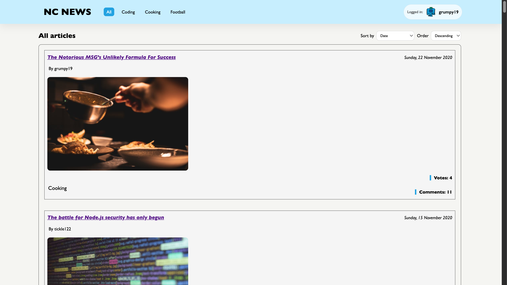
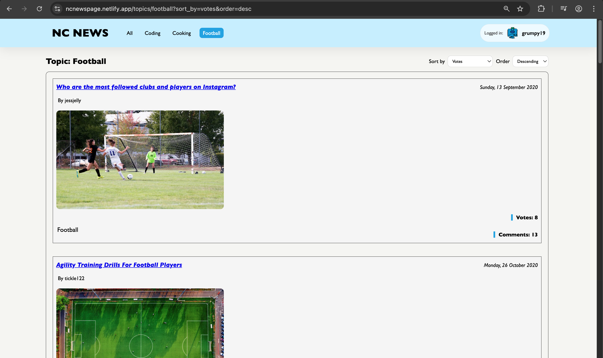
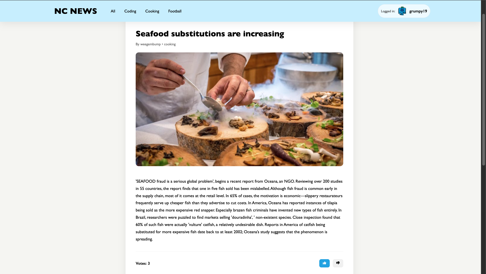
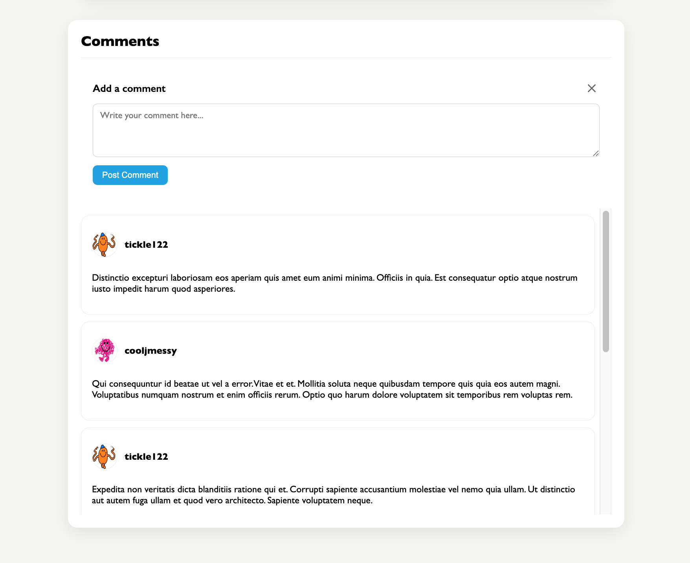
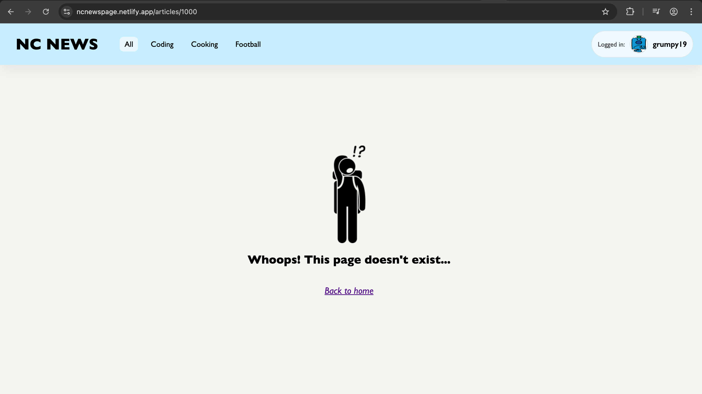

# NC News – Frontend

## Live Demo

Deployed version: https://ncnewspage.netlify.app/

> Please note: The backend is hosted on Render’s free tier, so the API may take a few seconds to respond on the first request after a period of inactivity.

## Project Overview

- NC News is a Reddit-style news aggregation web application that allows users to browse, sort, vote on, and comment on articles across a range of topics.

- This project focuses on building a responsive, interactive front-end using React that consumes data from a custom RESTful API.

- The application communicates with a separately hosted backend service to retrieve and update data.

## Features

- View a list of all articles

- Filter articles by topic

- Sort articles by date, comment count, or votes

- View individual articles

- Vote on articles (optimistic rendering)

- View comments for an article

- Post new comments

- Delete comments (authored by the logged-in user)

<details>
<summary>Screenshots</summary>







</details>

## Tech Stack

React

JavaScript (ES6+)

HTML

CSS

RESTful API integration

Netlify (deployment)

## Backend Repo

Backend Repository

This frontend consumes data from a custom built API.

**Backend repo: https://github.com/ofeore/back-end-nc-news**

**API Documentation with endpoints: https://back-end-nc-news-71fp.onrender.com/api/**

The backend is built with:

- Node.js

- Express

- PostgreSQL

- Jest & Supertest (testing)

## Running Locally

### Minimum Requirements:

- Node.js v18+ recommended

1. Clone the repository:

```
git clone https://github.com/ofeore/nc_news.git
```

2. Navigate to project directory

```
cd nc_news
```

3. Install dependencies and start development server

```
npm install
npm run dev
```

The app should now be running locally (usually on http://localhost:5173 if using Vite).

## Future Improvements

This project is actively being refined. Planned improvements include:

- Improving accessibility and semantic markup

- Adding user authentication

- Refactoring API logic into reusable hooks

- Improving test coverage

**This portfolio project was created as part of a Digital Skills Bootcamp in Software Engineering provided by Northcoders.**
